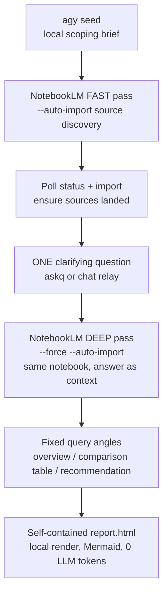
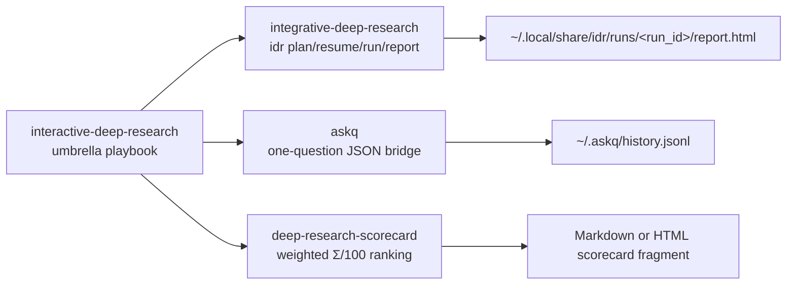

# Interactive Deep Research

[](https://github.com/Martin-Hausleitner/interactive-deep-research/actions/workflows/ci.yml)
[](LICENSE)
[](https://www.python.org/)

Deterministic, token-frugal deep research with one human clarification step.
NotebookLM does the heavy research and synthesis; this repository provides the
local orchestration, question bridge, scorecard utility, packaged skills, and
self-contained HTML report rendering.

The core idea is simple: keep the orchestrator rigid and cheap, delegate the
research reasoning to NotebookLM, then render the final report locally with
0 formatting tokens.

## Pipeline



Why this shape:

- `agy` produces a short scoping waypoint before NotebookLM starts.
- The fast pass gets breadth and source discovery without committing to a full run.
- `askq` creates exactly one human-in-the-loop pause.
- The deep pass runs on the same notebook, with the human answer folded in.
- Fixed query angles make output reproducible across topics.
- HTML rendering is local and dependency-free.

## Requirements

- Python 3.10+.
- `~/.local/bin` on `PATH` for the installed `idr`, `askq`, and `scorecard`
  symlinks.
- `nlm` NotebookLM CLI for live runs; authenticate once with `nlm login` and
  verify with `nlm doctor`.
- `agy` Antigravity CLI is optional. If missing or failing, `idr` falls back to
  the original topic/brief.
- `pytest` is only needed for contributors and verification.

## Skills And CLIs



| Skill | CLI | Purpose |
| --- | --- | --- |
| `interactive-deep-research` | guide only | Umbrella orchestration playbook for the full system. |
| `integrative-deep-research` | `idr` | Driver for plan, resume, full run, and report regeneration. |
| `askq` | `askq` | Human-in-the-loop question bridge with JSON stdout. |
| `deep-research-scorecard` | `scorecard` | Weighted candidate ranking that crowns a winner. |

Install the packaged skills and CLI symlinks:

```bash
./install.sh
```

By default this copies skills to `~/.claude/skills` and links drivers into
`~/.local/bin`. Override with `CLAUDE_SKILLS_DIR` or `BIN_DIR` if needed.

Current release: `v0.1.0`. This is a source-installed CLI/skill bundle; no
package-manager distribution is published for `v0.1.0`.

Install the release from source:

```bash
git clone https://github.com/Martin-Hausleitner/interactive-deep-research.git
cd interactive-deep-research
git checkout v0.1.0
./install.sh
./scripts/verify.sh
```

## Quickstart

Preferred phased flow for agent environments:

```bash
idr plan "Best open-source DE+EN voice cloning stack 2026"
```

The command prints JSON containing `run_id`, `rundir`, `notebook_id`, and the one
clarifying `question`. Relay that question to the human, then continue:

```bash
idr resume <run_id> --answer "Prioritize self-hostable open-source; exclude SaaS."
```

The final artifact is written to:

```text
~/.local/share/idr/runs/<run_id>/report.html
```

Output contracts:

| Command | stdout | Main artifacts |
| --- | --- | --- |
| `idr plan "<topic>"` | JSON `{run_id, rundir, notebook_id, question}` | `state.json`, `seed.md`, optional `agy_brief.md` |
| `idr resume <run_id> --answer "<answer>"` | JSON `{run_id, report, notebook_id}` | `content/{overview,comparison,recommendation}.md`, `report.html` |
| `idr report <run_id>` | JSON `{report}` | regenerated `report.html` |
| `askq "..." --answer "..."` | JSON `{id, question, choices, answer, mode, timed_out, ts}` | optional `~/.askq/history.jsonl` |
| `scorecard spec.json` | Markdown or HTML with `--html` | none |

Automation or terminal-only loop:

```bash
idr run "Best open-source DE+EN voice cloning stack 2026"
```

Offline smoke test, with no `agy`, NotebookLM, login, or network:

```bash
IDR_MOCK=1 idr plan "Test topic"
IDR_MOCK=1 idr resume <run_id> --answer "Self-hosted only."
```

Score a researched comparison:

```bash
scorecard data/voice_scorecard.json
scorecard data/voice_scorecard.json --html > /tmp/voice_scorecard.html
```

Ask one structured question directly:

```bash
askq "Which deployment constraint matters most?" --choices "self-hosted|SaaS|hybrid"
askq "Constraint?" --answer "self-hosted" --no-log
```

## Worked Examples

The repository includes two rendered proof examples:

- Voice cloning stack for German and English:
  `reports/voice/`, scorecard spec `data/voice_scorecard.json`.
- Cross-channel messaging stack:
  `reports/messaging/`, scorecard spec `data/messaging_scorecard.json`.

The proof site generator lives in `site/`:

```bash
python3 site/build_goal_site.py
open site/goal_site.html
```

Live proof site after Pages deploy:

```text
https://martin-hausleitner.github.io/interactive-deep-research/
```

Serve the proof site locally:

```bash
python3 -m http.server 5181 --directory site
open http://127.0.0.1:5181/
```

## Verification

Mock and CI-safe verification:

```bash
./scripts/verify.sh
```

This runs syntax checks, the non-live pytest suite, deterministic proof-site
rendering, whitespace checks, layout/bytecode hygiene, private-marker scans, and
common token-shape checks.

Opt-in live NotebookLM E2E verification, which spends quota and requires an
authenticated `nlm` CLI:

```bash
IDR_LIVE_E2E=1 IDR_REQUIRE_LIVE=1 pytest -m live tests/test_live_idr_e2e.py
```

Proof-site render check:

```bash
python3 site/build_goal_site.py
python3 -m http.server 5181 --directory site
```

Build the exact GitHub Pages upload artifact:

```bash
./scripts/build_pages_artifact.sh _site
```

Expected artifacts:

- `~/.local/share/idr/runs/<run_id>/report.html` for live or mock `idr` runs.
- `site/goal_site.html` for the local proof site.
- `_site/index.html` plus `_site/reports/`, `_site/audio/`, and
  `_site/openaudio-calculator/` for the Pages artifact.
- `reports/voice/report.html` and `reports/messaging/report.html` as worked examples.

See [TESTING.md](TESTING.md) for the full test matrix and live-run safety notes,
and [VERIFICATION.md](VERIFICATION.md) for the latest evidence ledger.

Useful environment variables:

| Variable | Purpose |
| --- | --- |
| `IDR_MOCK=1` | Run without `agy`, NotebookLM, network, or auth. |
| `IDR_RUNS_DIR=/tmp/idr-runs` | Write run artifacts outside the default user data directory. |
| `ASKQ_SCRIPT=/path/to/askq.py` | Override the `askq` script used by `idr run`. |
| `IDR_REQUIRE_LIVE=1` | Fail closed if a live NotebookLM step falls back or fails. |
| `IDR_LIVE_E2E=1` | Enable the opt-in pytest live E2E test. |
| `IDR_LIVE_TOPIC`, `IDR_LIVE_ANSWER` | Override the synthetic topic/answer used by the opt-in live test. |
| `ASKQ_ANSWER=...` | Provide a non-interactive answer to `askq`. |

`IDR_REQUIRE_LIVE=1` and `IDR_MOCK=1` are mutually exclusive. Required-live
mode exists specifically to prove the real NotebookLM path.

## Privacy

Use synthetic, non-sensitive topics for tests and examples. Do not type secrets,
credentials, personal data, private customer data, or other sensitive material
into `askq`, `idr`, NotebookLM, or generated reports.

`askq` logs Q&A to `~/.askq/history.jsonl` by default. For sensitive or test
questions, use `--no-log`, a temporary `--log`, or delete the history file after
the run. Tests in this repo avoid the default user log.

## Failure Modes

| Symptom | Likely cause | Fix |
| --- | --- | --- |
| `nlm` not found | NotebookLM CLI missing from `PATH` | Install/configure `nlm`, then run `nlm doctor`. |
| NotebookLM auth error | Expired browser/cookie auth | Run `nlm login`, then `nlm doctor`. |
| Live `plan` has no `notebook_id` | Fast pass failed or output changed | Re-run with `IDR_REQUIRE_LIVE=1` for fail-closed diagnostics. |
| Canned or weak clarifying question | Sources not imported yet | Ensure status polling and explicit `nlm research import` ran. |
| Deep pass blocks or aborts | Existing pending research prompt | Use the built-in `--force` path. |
| 429 or very slow run | NotebookLM quota/backoff | Wait, reduce live runs, use `IDR_MOCK=1` for CI. |
| `idr run` appears stuck | Bare interactive `askq` is waiting for input | Prefer `idr plan/resume` in agents or pass `ASKQ_ANSWER`. |
| `idr run` fails with `askq failed` | `ASKQ_SCRIPT` missing or not executable | Run `./install.sh`, set `ASKQ_SCRIPT`, or use phased `idr plan/resume`. |
| `scorecard` exits non-zero | Invalid JSON/spec, bad weights, scores outside scale | Validate the spec against the documented JSON shape. |

## Repository Layout

```text
interactive-deep-research/
├── README.md
├── install.sh
├── scripts/
│   └── verify.sh
├── skills/
│   ├── interactive-deep-research/
│   ├── integrative-deep-research/
│   ├── askq/
│   └── deep-research-scorecard/
├── site/
│   ├── build_goal_site.py
│   ├── build_audios.py
│   ├── audio_demos.json
│   ├── site_config.json
│   ├── PROGRESS.md
│   └── audio/
├── reports/
│   ├── voice/
│   └── messaging/
├── data/
│   ├── voice_scorecard.json
│   └── messaging_scorecard.json
└── openaudio-calculator/
```

`site/` is canonical for proof-site build inputs. Root-level duplicates of the
site builder inputs were intentionally removed.

`openaudio-calculator/` is an example side artifact, not part of the core `idr`
pipeline.

## Notes And Gotchas

- `nlm query` returns JSON. Parse `.value.answer`, not raw stdout.
- NotebookLM deep research needs `--force` for headless runs, otherwise it can
  stop on an interactive confirmation prompt.
- `fast --auto-import` can return before sources are imported. Poll status and
  explicitly import before asking the clarifying question.
- `agy` can prepend status noise; strip leading progress lines before using its
  output.
- Keep fixed query prompts topic-anchored with `Topic: <topic>` to avoid drift.
- NotebookLM quotas and transient 429s are real; use `IDR_MOCK=1` for CI and
  smoke tests.

## Preflight

```bash
nlm doctor
agy --version
IDR_MOCK=1 idr plan "smoke test"
```

Run `nlm login` if NotebookLM auth has expired. `agy` is optional; if missing,
the pipeline falls back to the original topic/brief.

## License

MIT. See [LICENSE](LICENSE).
