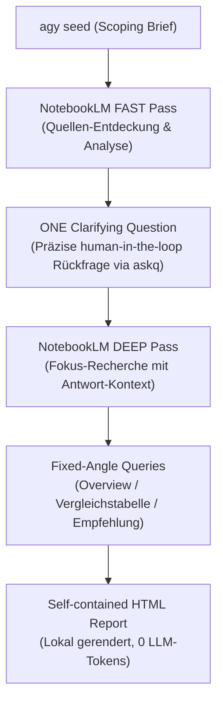

# 🔬 Interactive Deep Research

> Ein deterministisches, extrem token-sparsames System für interaktives Deep Research mit Human-in-the-Loop. NotebookLM übernimmt das schwere Reasoning; der finale HTML-Report wird lokal mit **0 LLM-Tokens** generiert.

---

## 🌊 Pipeline (Ablauf)



---

## 🛠️ Engine- und Umbrella-Skills

Das System besteht aus einem orchestratorischen Umbrella-Leitfaden und zwei eigenständigen CLI-Engines:

| Skill | Pfad / CLI-Kommando | Aufgabe / Beschreibung |
| :--- | :--- | :--- |
| **Interactive Deep Research** (Umbrella) | [skills/interactive-deep-research/SKILL.md](skills/interactive-deep-research/SKILL.md) | **Der systemweite Leitfaden.** Beschreibt das Zusammenspiel der Engines, Best Practices aus realen Läufen und die Reproduktion der Proof-Site. |
| **Integrative Deep Research** (Engine) | [skills/integrative-deep-research/SKILL.md](skills/integrative-deep-research/SKILL.md) &rarr; `idr` | **Der rigid getaktete Pipeline-Driver.** Führt den Antigravity-Seed, die NotebookLM-Durchläufe (fast & deep), die festgelegten Auswertungswinkel und das HTML-Rendering aus. |
| **Askq** (Engine) | [skills/askq/SKILL.md](skills/askq/SKILL.md) &rarr; `askq` | **Das Rückfrage-Primitiv.** Blockiert die Pipeline für genau eine präzise human-in-the-loop Klärungsfrage, liest die Eingabe und gibt sie als strukturiertes JSON zurück. |

---

## ⚡ Quickstart

### 1. Installation
Installiert die 3 Skills im lokalen Agenten-Pfad (`~/.claude/skills`) und verlinkt `idr` und `askq` global auf deinen `PATH`:
```bash
./install.sh
```

### 2. Phased Execution (Empfohlen in Claude Code)
Um Token-schonend und ohne blockierende Terminal-Eingaben zu arbeiten:

* **Schritt 1: Planen & Rückfrage generieren**
  ```bash
  idr plan "Zukunft des DE/EN Voice-Cloning Stacks"
  ```
  *Schreibt den Seed und liefert die JSON-Antwort inklusive der einen Klärungsfrage zurück.*

* **Schritt 2: Fortsetzen mit der Antwort des Nutzers**
  ```bash
  idr resume <run_id> --answer "Fokus liegt ausschließlich auf kommerziell nutzbaren Open-Source-Lizenzen."
  ```
  *Führt den NotebookLM Deep-Pass aus und generiert den HTML-Report unter `~/.local/share/idr/runs/<run_id>/report.html`.*

### 3. Offline / Smoke-Test (Simulation)
Nutze den Mock-Modus, um die Pipeline lokal ohne API-Keys oder Internetverbindung zu testen:
```bash
IDR_MOCK=1 idr plan "Test-Thema"
IDR_MOCK=1 idr resume <run_id> --answer "Option A"
```

---

## 🧭 Preflight Checks

* **NotebookLM API / CLI:**
  Stelle sicher, dass das `nlm` CLI einsatzbereit ist:
  ```bash
  nlm doctor
  ```
  Sollte die API einen Authentifizierungsfehler werfen, logge dich erneut ein:
  ```bash
  nlm login
  ```
* **Antigravity CLI (`agy`):**
  Optional, aber empfohlen. Ist das `agy` CLI installiert, agiert es als lokaler Scoping-Agent (Waypoint 1), um das Thema vor NotebookLM zu schärfen. Fehlt das Tool, läuft die Pipeline mit einem Standard-Brief weiter.

---

## 🏆 Die Proof-Site (Zwei Beispiel-Szenarien)

Das Projekt enthält unter [site/build_goal_site.py](site/build_goal_site.py) einen datengetriebenen Website-Generator, der die Resultate und den genauen *Gedankenverlauf* (Runden, Rückfragen) zweier realer, cross-verifizierter Deep-Researches aufbereitet:

### Szenario A: DE/EN Voice-Cloning Stack
* **Ziel:** Das qualitativ beste Voice-Cloning-Setup für Deutsch und Englisch.
* **Verlauf:** 4 interaktive Analyse-Runden (NotebookLM Fast Pass & Web-Checks).
* **Ergebnis:**
  * **Klarer Sieger:** **Chatterbox Multilingual** (MIT-Lizenz) und **CosyVoice 3.0** / **CosyVoice2-EU** (Apache-Lizenz).
  * *Fish/OpenAudio S1-S2* bietet zwar herausragende Qualität, scheitert jedoch an der Non-Commercial-Lizenz.
  * *XTTS-v2* ist nach dem Coqui-Aus lizenztechnisch eine Sackgasse.

### Szenario B: Cross-Channel-Messaging Stack
* **Ziel:** Kostengünstige und sperr-resistente Messaging-Automatisierung.
* **Verlauf:** NotebookLM Deep Pass über **111 analysierte Quellen**.
* **Ergebnis:**
  * **Klarer Sieger:** Ein selbst gehostetes Setup aus **Matrix Homeserver**, **Mautrix-Bridges**, **GoLogin** und **Claude Computer Use** ($30–$60/Monat) bietet die höchste Resilienz gegen Profil-Sperren.
  * Im kommerziellen Segment bieten sich *Waalaxy* (preiswert) und *La Growth Machine* (Bannquote < 0.1% als Premium-Lösung) an.

**Vorschau der Proof-Site generieren:**
```bash
python3 site/build_goal_site.py
open site/goal_site.html
```

---

## 📂 Repo-Layout

```text
interactive-deep-research/
├── README.md                           # Diese System-Dokumentation
├── install.sh                          # Installiert Skills und verlinkt idr & askq
├── skills/
│   ├── interactive-deep-research/      # Umbrella-Skill (Koordinierungs-Guide)
│   │   └── SKILL.md
│   ├── integrative-deep-research/      # Pipeline-Engine
│   │   ├── SKILL.md
│   │   └── scripts/
│   │       └── idr.py                  # Core-Python-Driver (plan, resume, run)
│   └── askq/                           # Rückfrage-Engine (human-in-the-loop CLI)
│       ├── SKILL.md
│       └── scripts/
│           └── askq.py                 # Rückfrage-Script (stdin -> JSON stdout)
├── site/
│   ├── build_goal_site.py              # Baut die Präsentations-Website
│   ├── PROGRESS.md                     # Dokumentation der Runden & Ergebnisse
│   └── agy_summary.txt                 # Executive Summary (Antigravity-verfasst)
└── LICENSE                             # Lizenzdatei (MIT)
```

---

## 📄 Lizenz

Dieses System ist unter der [MIT-Lizenz](LICENSE) lizenziert.
