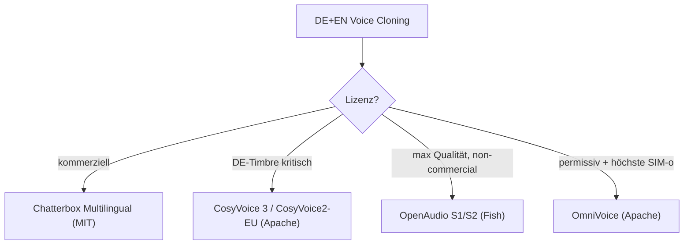

## Überblick — Bester Open-Source Voice-Cloning-Stack für Deutsch + Englisch (2026)

**Deutsch ist der entscheidende Filter.** Viele Top-Modelle 2025/26 sind EN/ZH-first und behandeln Deutsch nur als cross-lingual Best-Effort. Echte DE-Benchmarks fehlen fast völlig — es gibt **kein deutsches TTS-Leaderboard** und kaum publizierte DE-MOS/WER-Zahlen. Vier interaktive Runden (agy→NotebookLM Fast + 3 unabhängige Web-Engines) haben das Feld vermessen und gegen ein internes Baseline-Artefakt abgeglichen.

