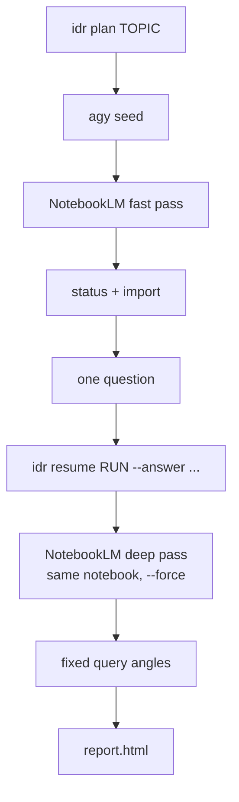

# Integrative Deep Research

`integrative-deep-research` is the pipeline driver. It keeps the agent's work
small and deterministic: fire fixed CLI steps, relay exactly one question to the
human, and let NotebookLM do the expensive research reasoning.

CLI: `idr` on PATH, or:

```bash
python3 ~/.claude/skills/integrative-deep-research/scripts/idr.py
```

Run artifacts live in:

```text
~/.local/share/idr/runs/<run_id>/
```

## Fixed Flow



1. `agy` scoping seed: write `seed.md`, optionally ask Antigravity for a short
   NotebookLM-ready brief.
2. NotebookLM fast pass: `nlm research start --mode fast --auto-import`.
3. Import stabilization: poll `nlm research status`, then run `nlm research import`.
4. One clarifying question: ask NotebookLM for the single most important question.
5. Human answer: relay in chat for agent sessions, or use `askq` in terminals.
6. NotebookLM deep pass: same notebook, user answer as context, `--force --auto-import`.
7. Fixed angles: overview, comparison table, recommendation.
8. Local HTML report: `report.html`, Mermaid-capable, 0 formatting tokens.

## Commands

Phased mode, preferred inside coding/agent environments:

```bash
idr plan "<topic>"
idr resume <run_id> --answer "<human answer>"
```

Full interactive terminal loop:

```bash
idr run "<topic>"
```

Regenerate the report from existing run content:

```bash
idr report <run_id>
```

Offline smoke test:

```bash
IDR_MOCK=1 idr plan "test topic"
IDR_MOCK=1 idr resume <run_id> --answer "self-hosted only"
```

`--mock` is equivalent for `plan` and `run`.

## Output Contract

| Command | stdout | Main files |
| --- | --- | --- |
| `idr plan` | JSON `{run_id, rundir, notebook_id, question}` | `state.json`, `seed.md`, optional `agy_brief.md` |
| `idr resume` | JSON `{run_id, report, notebook_id}` | `content/*.md`, `report.html`, updated `state.json` |
| `idr report` | JSON `{report}` | regenerated `report.html` |

Live verification should set `IDR_REQUIRE_LIVE=1`; this turns missing notebook
IDs, failed `nlm query`, and failed deep passes into non-zero errors instead of
falling back to mock text.
Do not combine `IDR_REQUIRE_LIVE=1` with `IDR_MOCK=1`.

## Agent Guidance

- Do not ask clarifying questions before `idr plan`; the pipeline creates the one
  sanctioned question after source discovery.
- In non-interactive agent sessions, do not run a bare blocking `askq`. Relay the
  returned `question` to the user, then call `idr resume`.
- Keep the `run_id`; it is the stable handle for state, content, and the report.
- Use `deep-research-scorecard` after research when a comparison needs a decisive
  weighted winner.

## Preflight

```bash
nlm doctor
agy --version
IDR_MOCK=1 idr plan "smoke test"
```

`agy` is optional. If it is unavailable or fails, the driver falls back to the
original topic/brief. `nlm` needs an authenticated NotebookLM session for live runs.

## Environment Contract

| Variable | Effect |
| --- | --- |
| `IDR_MOCK=1` | Stub `agy` and NotebookLM; full plan/resume/report flow runs offline. |
| `IDR_RUNS_DIR=/tmp/idr-runs` | Override the run artifact directory. Use this in tests. |
| `ASKQ_SCRIPT=/path/to/askq.py` | Override the question bridge used by `idr run`. |
| `IDR_REQUIRE_LIVE=1` | Fail closed on live NotebookLM failures instead of falling back to mock text. |
| `IDR_LIVE_E2E=1` | Used by pytest to enable the opt-in live NotebookLM E2E. |
| `IDR_LIVE_TOPIC`, `IDR_LIVE_ANSWER` | Override the synthetic live E2E topic/answer. |

## Privacy / No PII

Use synthetic or public topics for tests, CI, and examples. Do not put secrets,
credentials, personal data, private customer material, account IDs, or internal
hostnames into topics, human answers, NotebookLM notebooks, `askq` logs, run
state, content files, or rendered reports. If a live run requires sensitive
context, keep it outside the repository and do not commit the run directory.

## Gotchas

- `nlm query` returns JSON; parse `.value.answer`.
- NotebookLM deep research needs `--force` in headless runs.
- `fast --auto-import` can return before sources are imported; poll and import.
- `agy` may print leading status lines; strip them before using the answer.
- Prefix fixed query prompts with `Topic: <topic>` so the notebook stays on-task.
- Use `IDR_MOCK=1` for CI and smoke tests to avoid auth, network, and quota issues.

## Failure Modes

| Symptom | Cause | Fix |
| --- | --- | --- |
| `nlm` missing/auth error | NotebookLM CLI unavailable or login expired | `nlm login`, then `nlm doctor`. |
| `notebook_id` is empty | Fast pass failed or CLI output changed | Use `IDR_REQUIRE_LIVE=1` and inspect stderr. |
| Weak/canned question | Sources were not imported | Ensure status wait + explicit import ran. |
| Deep pass prompt/abort | Pending NotebookLM research | The driver uses `--force`; upgrade `nlm` if behavior changes. |
| Agent session blocks | `idr run` invoked interactive `askq` | Use `idr plan/resume` or `ASKQ_ANSWER`. |
| `askq failed` | `ASKQ_SCRIPT` missing/not executable | Install skills or set `ASKQ_SCRIPT` to the repo script. |
| Quota/429 | NotebookLM quota/backoff | Wait or use `IDR_MOCK=1`. |
