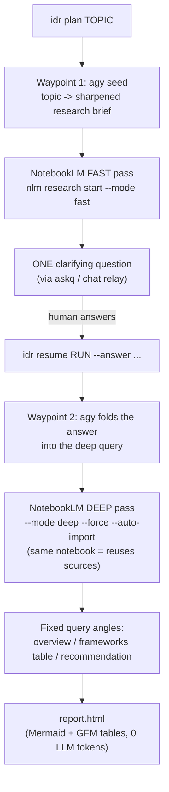

# Interactive Deep Research — system guide

This is the **map**. The actual work is done by two small, single-purpose engine
skills; this skill explains how they compose and how to drive the whole thing.

The design goal: **deterministic + extremely token-frugal** research. The orchestrating
model does almost no reasoning — it fires a fixed sequence of CLI commands and relays
exactly ONE clarifying question to the human. All heavy reasoning is delegated to
**NotebookLM**; the final HTML report is rendered locally with **zero LLM tokens**.

## The two engines

| Skill | Driver | Job |
|---|---|---|
| [[integrative-deep-research]] | `idr` | The rigid pipeline: Antigravity seed → NotebookLM fast/deep → fixed-angle queries → HTML report. |
| [[askq]] | `askq` | The portable human-in-the-loop "Rückfrage" primitive: print ONE question, block for a typed answer, return clean JSON on stdout. |

## The fixed flow (what actually happens)



**Why two NotebookLM passes on the same notebook?** The fast pass discovers sources and
yields the single most valuable clarifying question; the human's answer then sharpens the
deep pass — which **reuses the same notebook's sources**, so it is cheap and grounded.

## How to run it

Token-efficient, phased (preferred inside Claude Code — no blocking stdin):

```bash
idr plan "<the user's topic>"           # -> JSON {run_id, question, ...}; relay question to human
idr resume <run_id> --answer "<answer>" # -> {run_id, report}; deep pass + HTML
open "<report path>"                     # report.html lives in the run dir
```

Full interactive loop (terminal / other CLI agents — `askq` blocks for the human):

```bash
idr run "<topic>"
```

Offline / self-test (stubs Antigravity + NotebookLM, full loop runs with no network):

```bash
IDR_MOCK=1 idr plan "test topic"
IDR_MOCK=1 idr resume <run_id> --answer "self-hosted only"
```

State for every run: `~/.local/share/idr/runs/<run_id>/` (`state.json`, `seed.md`,
`agy_brief.md`, `content/*.md`, `report.html`).

## Preflight

- **NotebookLM** — `nlm doctor`; run `nlm login` if it errors. The `nlm` CLI is the
  engine that makes this deterministic and cheap (`research start --mode fast|deep`,
  `query`, `report`). NotebookLM has a ~50 deep-research runs/day quota — web-research
  subagents are the quota-free second engine + cross-verification.
- **Antigravity (`agy`)** — optional but recommended. `agy -p "<prompt>" --dangerously-skip-permissions`
  is a real headless agent; the pipeline uses it as a **waypoint** (sharpen the brief, fold
  the human answer). If `agy` is absent the seed file is still written and the flow continues.

## The proof site (`site/`)

`site/build_goal_site.py` is a **data-driven** generator (reads run `state.json` + askq
history + `site_config.json` → one self-contained HTML page). It documents two real
end-to-end runs as worked examples:

- **A — DE/EN voice-cloning stack:** converged (NotebookLM deep pass, 65 sources) on
  **CosyVoice 3.0 (Apache) / Chatterbox Multilingual (MIT)** as the best commercial-friendly
  stack; Fish/OpenAudio S1–S2 = best quality but non-commercial; XTTS-v2 = dead-end.
- **B — cross-channel messaging stack:** (111 sources) → Matrix + Mautrix + GoLogin +
  Claude Computer-Use self-build.

Rebuild + preview:

```bash
python3 site/build_goal_site.py          # regenerates site/goal_site.html
open site/goal_site.html
```

## Gotchas (learned from live runs)

- `nlm query notebook <id> "..."` returns `{"value":{"answer": "..."}}` — parse
  `.value.answer`, not raw stdout.
- The **deep** pass needs `--force` (and import the prior fast task first) or it blocks on
  an interactive `Continue? [y/N]` prompt and aborts. Retry once on transient
  `read operation timed out`.
- The fast pass `--auto-import` can return **before** sources land — wait via
  `research status --max-wait` then explicit `research import`, else the clarifying-question
  query falls back to a canned question.
- Keep query prompts **topic-anchored** and the comparison angle generic; a non-anchored
  run came back polluted with unrelated content.
- `agy` prepends a `> 🚀 Starting Gemini CLI …` status line to its output — strip it.

## Install

```bash
./install.sh    # copies the 3 skills into ~/.claude/skills and links idr + askq onto PATH
```
