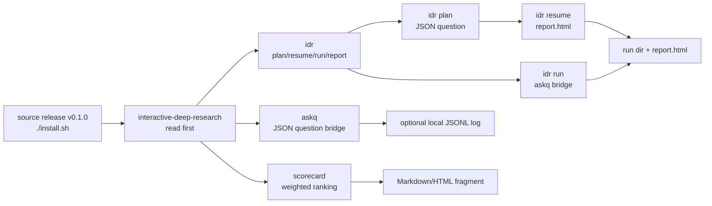
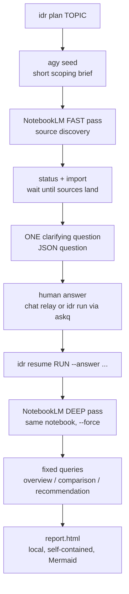

# Interactive Deep Research

This is the umbrella playbook. Use it to understand and coordinate the engine
skills; use `integrative-deep-research` when you actually run the pipeline.

Design principle: deterministic orchestration, NotebookLM-backed reasoning, one
human clarification, local HTML rendering.

## Install From Source

This skill ships in the `v0.1.0` source release with the companion `idr`,
`askq`, and `scorecard` CLIs. Install the bundle from the repository root:

```bash
git clone https://github.com/Martin-Hausleitner/interactive-deep-research.git
cd interactive-deep-research
git checkout v0.1.0
./install.sh
```

By default the installer copies skills to `~/.claude/skills` and creates CLI
symlinks in `~/.local/bin`. Override with `CLAUDE_SKILLS_DIR` or `BIN_DIR` if
needed. There is no package-manager distribution for `v0.1.0`; use the tagged
source checkout for reproducible installs.

## Components

| Component | CLI | Role |
| --- | --- | --- |
| `integrative-deep-research` | `idr` | Runs the full pipeline and renders `report.html`. |
| `askq` | `askq` | One-question human bridge, JSON stdout, audit log. |
| `deep-research-scorecard` | `scorecard` | Converts researched candidates into a weighted ranking. |



## Canonical Flow



## How To Invoke

Agent-safe phased mode:

```bash
idr plan "<topic>"
idr resume <run_id> --answer "<answer>"
```

Terminal interactive mode:

```bash
idr run "<topic>"
```

Offline smoke:

```bash
IDR_MOCK=1 idr plan "test topic"
IDR_MOCK=1 idr resume <run_id> --answer "self-hosted only"
```

Live proof mode:

```bash
IDR_REQUIRE_LIVE=1 idr plan "<small synthetic topic>"
IDR_REQUIRE_LIVE=1 idr resume <run_id> --answer "<synthetic answer>"
```

Use `IDR_RUNS_DIR=/tmp/idr-runs` when a test or verifier must avoid writing to
the user's default run directory.

Verification commands:

```bash
./scripts/verify.sh
pytest -p no:cacheprovider -m "not live"
IDR_LIVE_E2E=1 IDR_REQUIRE_LIVE=1 pytest -m live tests/test_live_idr_e2e.py
```

`./scripts/verify.sh` is the primary local and CI-safe gate. The pytest command
shown above is the underlying non-live test selector. The live command is opt-in
because it uses NotebookLM auth, network, and quota.

## Output Contract

| Command | stdout | Main artifacts |
| --- | --- | --- |
| `idr plan "<topic>"` | JSON `{run_id, rundir, notebook_id, question}` | `state.json`, `seed.md`, optional `agy_brief.md` |
| `idr resume <run_id> --answer "<answer>"` | JSON `{run_id, report, notebook_id}` | `content/{overview,comparison,recommendation}.md`, `report.html` |
| `idr run "<topic>"` | JSON `{run_id, report, notebook_id}` | same as plan + resume, with `askq` bridge |
| `idr report <run_id>` | JSON `{report}` | regenerated `report.html` |
| `askq "..." --answer "..."` | JSON `{id, question, choices, answer, mode, timed_out, ts}` | optional `~/.askq/history.jsonl` |
| `scorecard spec.json` | Markdown or HTML with `--html` | none |

## Environment Contract

| Variable | Effect |
| --- | --- |
| `IDR_MOCK=1` | Run without `agy`, NotebookLM, network, or auth. |
| `IDR_RUNS_DIR=/tmp/idr-runs` | Write run artifacts outside the default user data directory. |
| `ASKQ_SCRIPT=/path/to/askq.py` | Override the question bridge used by `idr run`. |
| `IDR_REQUIRE_LIVE=1` | Fail closed if a live NotebookLM step falls back or fails. |
| `IDR_LIVE_E2E=1` | Enable the opt-in pytest live E2E test. |
| `IDR_LIVE_TOPIC`, `IDR_LIVE_ANSWER` | Override the synthetic topic/answer used by the opt-in live test. |
| `ASKQ_ANSWER=...` | Provide a non-interactive answer to `askq` or `idr run`. |

Scorecard:

```bash
scorecard data/voice_scorecard.json
scorecard data/voice_scorecard.json --html
```

Direct question bridge:

```bash
askq "Which constraint matters most?" --choices "cost|quality|license"
askq "Constraint?" --answer "license" --no-log
```

## Proof Site

`site/` contains the canonical proof-site build inputs and generated local HTML.
It combines two worked examples:

- DE/EN voice cloning stack: `reports/voice/`, `data/voice_scorecard.json`.
- Cross-channel messaging stack: `reports/messaging/`, `data/messaging_scorecard.json`.

Rebuild locally:

```bash
python3 site/build_goal_site.py
open site/goal_site.html
```

## Operational Notes

- `nlm query` returns JSON; consume `.value.answer`.
- Use `--force` for NotebookLM deep research in headless mode.
- Poll/import after fast research before asking the clarifying question.
- Strip `agy` progress noise before treating its stdout as a brief.
- Keep query prompts topic-anchored.
- Use `IDR_MOCK=1` for contributor smoke tests and CI.
- Avoid secrets or personal data in topics, answers, askq logs, NotebookLM
  notebooks, and rendered reports.

## Privacy / No PII

Treat every topic, answer, scorecard, report, and proof-site artifact as
potentially publishable. Use synthetic inputs for tests and examples; keep
private customer data, credentials, account names, internal URLs, and local file
paths out of committed runs and rendered HTML.

## Security / Responsible Use

Follow the repository `SECURITY.md`: report vulnerabilities privately and do not
use the tooling to process secrets, credentials, private customer data, or other
sensitive material in committed artifacts.

## Failure Modes

| Symptom | Cause | Fix |
| --- | --- | --- |
| Live run silently degrades | NotebookLM failure fell back to mock text | Use `IDR_REQUIRE_LIVE=1` for proof runs. |
| Agent session blocks | `idr run` invoked interactive `askq` | Use phased `idr plan` then `idr resume`. |
| Proof-site links local paths | Run artifacts were rendered from machine-local paths | Rebuild from repo-relative `reports/` and `site/` inputs. |
| No decisive recommendation | Research stayed qualitative | Add `deep-research-scorecard` with explicit weights. |
