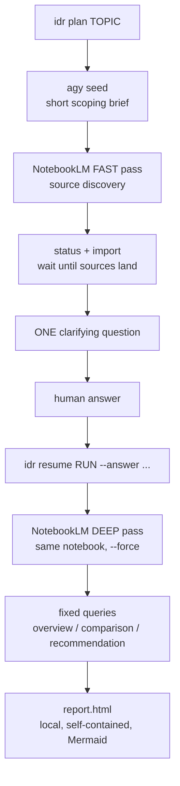

# Interactive Deep Research

This is the umbrella playbook. Use it to understand and coordinate the engine
skills; use `integrative-deep-research` when you actually run the pipeline.

Design principle: deterministic orchestration, NotebookLM-backed reasoning, one
human clarification, local HTML rendering.

## Components

| Component | CLI | Role |
| --- | --- | --- |
| `integrative-deep-research` | `idr` | Runs the full pipeline and renders `report.html`. |
| `askq` | `askq` | One-question human bridge, JSON stdout, audit log. |
| `deep-research-scorecard` | `scorecard` | Converts researched candidates into a weighted ranking. |

## Canonical Flow



## How To Invoke

Agent-safe phased mode:

```bash
idr plan "<topic>"
idr resume <run_id> --answer "<answer>"
```

Terminal interactive mode:

```bash
idr run "<topic>"
```

Offline smoke:

```bash
IDR_MOCK=1 idr plan "test topic"
IDR_MOCK=1 idr resume <run_id> --answer "self-hosted only"
```

Scorecard:

```bash
scorecard data/voice_scorecard.json
scorecard data/voice_scorecard.json --html
```

Direct question bridge:

```bash
askq "Which constraint matters most?" --choices "cost|quality|license"
askq "Constraint?" --answer "license" --no-log
```

## Proof Site

`site/` contains the canonical proof-site build inputs and generated local HTML.
It combines two worked examples:

- DE/EN voice cloning stack: `reports/voice/`, `data/voice_scorecard.json`.
- Cross-channel messaging stack: `reports/messaging/`, `data/messaging_scorecard.json`.

Rebuild locally:

```bash
python3 site/build_goal_site.py
open site/goal_site.html
```

## Operational Notes

- `nlm query` returns JSON; consume `.value.answer`.
- Use `--force` for NotebookLM deep research in headless mode.
- Poll/import after fast research before asking the clarifying question.
- Strip `agy` progress noise before treating its stdout as a brief.
- Keep query prompts topic-anchored.
- Use `IDR_MOCK=1` for contributor smoke tests and CI.
